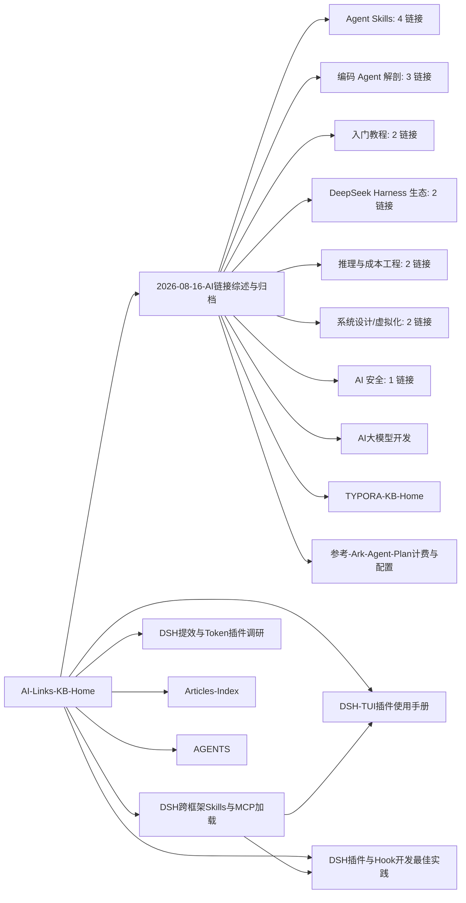

# AI 链接收藏库 — MOC

See also: [[AGENTS]] | [[AI大模型开发]] | [[TYPORA-KB-Home]] | [[2026-08-16-AI链接综述与归档]]

## 概述

收藏人「相·易」于 2026/05/05 与 2026/08/16 两批收藏的 16 条 AI 相关链接的调研综述库。子领域定位：**Agent 技能、编码 Agent 解剖、LLM 推理工程、系统设计与 AI 安全**。所有链接逐条给出内容、方向与学习价值评级，并按主题聚类综述。

> [!success] 状态
> 调研已全部完成（16/16 有效）；部分 star 数/版本为快照数据，待作者回访原链接复核 → `review`。

## 文档地图

| 文档 | 内容 |
|---|---|
| [[2026-08-16-AI链接综述与归档]] | ★ 主文档：全景表 + 7 类逐条分析 + 六条主线综述 + 学习价值矩阵 + 四阶段学习路线 |
| [[DSH跨框架Skills与MCP加载]] | DSH 加载外部生态 Skills/MCP 的三条路径（原生发现 / mcp-client / dsh-bridges） |
| [[DSH-TUI插件使用手册]] | 本机 @dsh-tui/dsh-tui 终端界面：安装、运行、快捷键、端点配置 |
| [[DSH插件与Hook开发最佳实践]] | Cordis 插件体系、工具/hooks 开发、发布与最佳实践清单 |
| [[DSH提效与Token插件调研]] | 官方 token-meter + 社区 Token/提效插件清单与推荐组合（2026-08-18） |
| [[Articles-Index]] | 远程文章库索引（可解释性/上下文工程/Skill/机制拆解 14 篇） |

## 文档关系图

## 标签索引

- `#ai/links` — 本子库（链接收藏/综述）
- `#ai/skills` — 技能开发（antigravity/i-have-adhd/pretty-mermaid/diagram-design）
- `#ai/agent` — 编码 Agent（Pi 书/pi-from-scratch/prime-agent/Harness 生态）
- `#ai/learning` — 教程与路线图（copilot-cli/exploreclaudecode/TTFT/system-design）+ 文章库学习类（[[Articles-Index]]：论文精读/上下文工程/Skill/机制拆解 13 篇）
- `#moc` — 本页

## 关键数据

| 项 | 值 |
|---|---|
| 链接总数 | 16（2026/05/05 × 3，2026/08/16 × 13） |
| 平均评级 | ★★★★（5★×4，4★×9，3★×3） |
| 调研方式 | flash 式 4 代理并行 web 检索 |
| 归档状态 | `review`（快照数据待作者复核） |

## 脚本清单

无（纯知识归档，本次会话无脚本产出）。

## 另见

- [[2026-08-16-AI链接综述与归档]] — 主文档（本页入口）
- [[Articles-Index]] — 文章库子 MOC：可解释性/上下文工程/Skill/机制拆解 13 篇文章（2026-08-17 迁移）
- 本 vault 其他复盘：[[v2rayn-balancer-复盘-2026-08-09]]、[[2026-07-21-树莓派网络故障与路由器破解完整复盘]]
