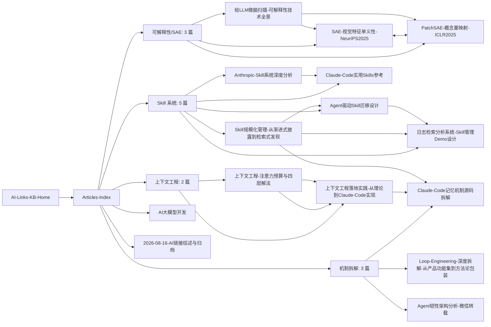

# AI 文章库索引 — 子 MOC

See also: [[AI-Links-KB-Home]] | [[2026-08-16-AI链接综述与归档]] | [[AI大模型开发]] | [[AGENTS]]

> [!abstract] 概述
> 2026-08-17 从远程仓库（`_install-tmp/akb-remote`）迁移来的技术文章合集：论文精读、源码拆解与系统设计。与 [[AI-Links-KB-Home]] 的「链接调研综述」互补——那边是 16 条收藏链接的调研，这里是「AI Agent / LLM 的原理与工程认知」深度文章。
> 每篇均可独立阅读，正文内用 `[[文件名]]` 交叉引用；frontmatter 已统一为 Obsidian 规范（title/aliases/tags/created/updated/status），原引用字段（source/source_urls/author/date/fetched_at）原样保留。

---

## 文档地图

### 🔬 可解释性 / SAE（3 篇）

打开模型黑盒，看它内部在算什么。

| 文档 | 回答的问题 | 日期 |
|------|-----------|------|
| [[给LLM做脑扫描-可解释性技术全景]] | 怎么给大模型做「CT/核磁/三维扫描」？四层技术栈与上手路径 | 2026-07-06 |
| [[SAE-视觉特征单义性-NeurIPS2025]] | SAE 如何在视觉-语言模型里学到单义特征？因果干预怎么验证 | 2025-04-03 |
| [[PatchSAE-概念重映射-ICLR2025]] | adaptation 期间视觉概念如何被选择性重映射？ | 2024-12-06 |

### 🧠 上下文工程（2 篇）

有限注意力预算下如何经营 context。

| 文档 | 回答的问题 | 日期 |
|------|-----------|------|
| [[上下文工程-注意力预算与四层解法]] | 为什么窗口越大模型越蠢？注意力预算视角 + 四层解法 | 2026-06-10 |
| [[上下文工程落地实践-从理论到Claude-Code实现]] | 上述理论如何在 Claude Code 源码里落地？ | 2026-06-22 |

### 🧩 Skill 系统与管理（5 篇）

Skill 从「几个」长到「几百个」后的组织问题。

| 文档 | 回答的问题 | 日期 |
|------|-----------|------|
| [[Claude-Code实用Skills参考]] | 有哪些实用 Skills？开发流程中怎么用？ | 2026-06-17 |
| [[Skill规模化管理-从渐进式披露到检索式发现]] | Skill 多到装不下时，如何从渐进式披露转向检索式发现？ | 2026-06-22 |
| [[Agent驱动Skill迁移设计]] | 如何用 Agent 驱动 Skill 系统迁移？审计怎么做？ | 2026-06-22 |
| [[日志检索分析系统-Skill管理Demo设计]] | Skill 管理框架（命名空间/依赖声明）落地 Demo 长什么样？ | 2026-06-22 |
| [[Anthropic-Skill系统深度分析]] | Anthropic Skill 系统的设计方案与实现方法全貌？ | 2026-06-12 |

### ⚙️ 机制拆解（3 篇）

Agent 产品内部是怎么实现的。

| 文档 | 回答的问题 | 日期 |
|------|-----------|------|
| [[Claude-Code记忆机制源码拆解]] | CLAUDE.md / 记忆机制在源码层面如何工作？ | 2026-06-02 |
| [[Loop-Engineering-深度拆解-从产品功能集到方法论包装]] | Loop 从产品功能集是怎么被包装成方法论的？ | 2026-06-25 |
| [[Agent韧性架构分析-微信转载]] | Claude Code 的容错/成本/认证/观测四支柱怎么设计？ | 2026-06-13 |

---

## 文档关系图

---

## 标签索引

- `#ai/learning` — 学习与精读：可解释性 3 篇、上下文工程落地实践、Skill 系统 5 篇、机制拆解 3 篇
- `#ai/skills` — Skill 系统相关：实用 Skills 参考、规模化管理、迁移设计、日志 Demo、Anthropic 深度分析（5 篇）
- `#ai/agent` — Agent 机制：记忆机制源码拆解、Loop-Engineering、Agent 韧性架构（3 篇）
- `#ai/links` — 微信转载：上下文工程理论、Agent 韧性架构分析（2 篇）
- `#reference` — 引用型文档：论文精读/转载原文出处（8 篇）
- `#moc` — 本页

---

## 关键数据

| 项 | 值 |
|---|---|
| 文章总数 | 13（articles/ 11 篇 + 仓库根目录 2 篇）；迁移清单 14 项 = 13 篇文章 + 本索引文档 |
| 分组 | 4 组：可解释性 3 / 上下文工程 2 / Skill 5 / 机制拆解 3 |
| 迁移日期 | 2026-08-17（源：`_install-tmp/akb-remote`，只读源未改动） |
| status 分布 | stable 10 篇 / review 3 篇（设计/Demo 类） |
| 命名调整 | 2 篇英文文件名改为中文：`Agent韧性架构分析-微信转载.md`、`Anthropic-Skill系统深度分析.md` |

---

## 阅读线索

- **想搞懂模型内部** → 可解释性三篇：先 [[给LLM做脑扫描-可解释性技术全景]] 建立全景，再深入 [[SAE-视觉特征单义性-NeurIPS2025]]、[[PatchSAE-概念重映射-ICLR2025]]。
- **想把 Agent 做稳/做省** → 上下文工程两篇（理论 → 落地），辅以 [[Agent韧性架构分析-微信转载]]（容错/成本四支柱）。
- **想管理规模化 Skill** → [[Claude-Code实用Skills参考]]（有什么可用）→ [[Anthropic-Skill系统深度分析]]（设计原理）→ [[Skill规模化管理-从渐进式披露到检索式发现]]（规模化方案）→ [[Agent驱动Skill迁移设计]] + [[日志检索分析系统-Skill管理Demo设计]]（落地）。
- **想懂 Claude Code 内部** → [[Claude-Code记忆机制源码拆解]] → [[Loop-Engineering-深度拆解-从产品功能集到方法论包装]]。

## 另见

- [[AI-Links-KB-Home]] — 父 MOC（本页入口）
- [[2026-08-16-AI链接综述与归档]] — 链接调研综述（文章库的姊妹文档）
- [[AI大模型开发]] — LLM 开发笔记（可解释性/注意力机制的姊妹主题）
